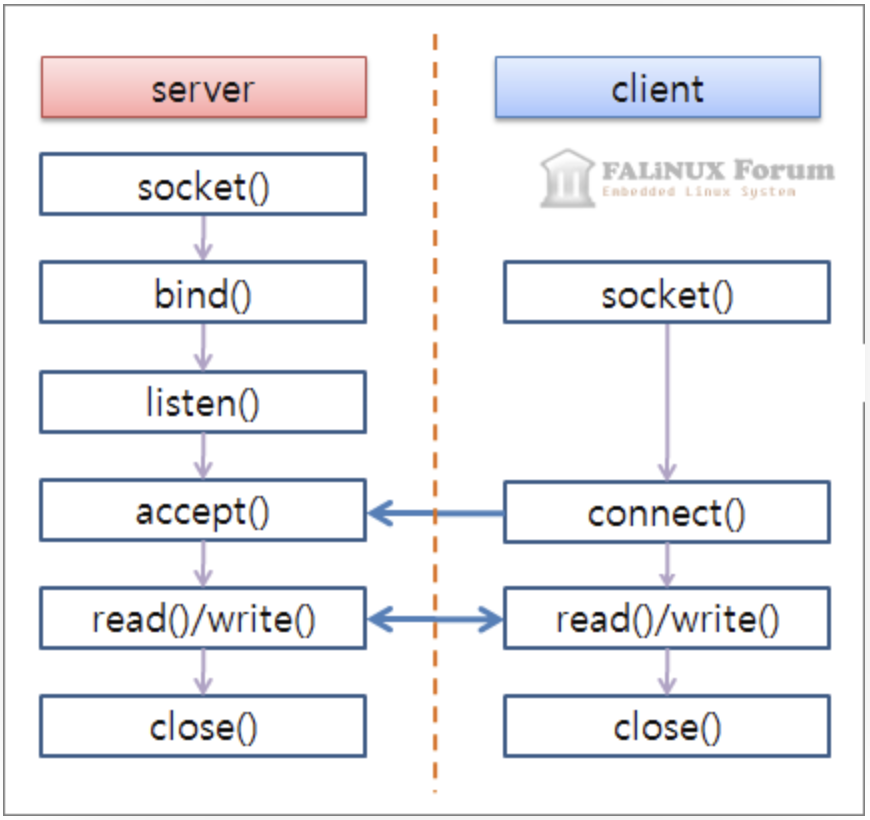
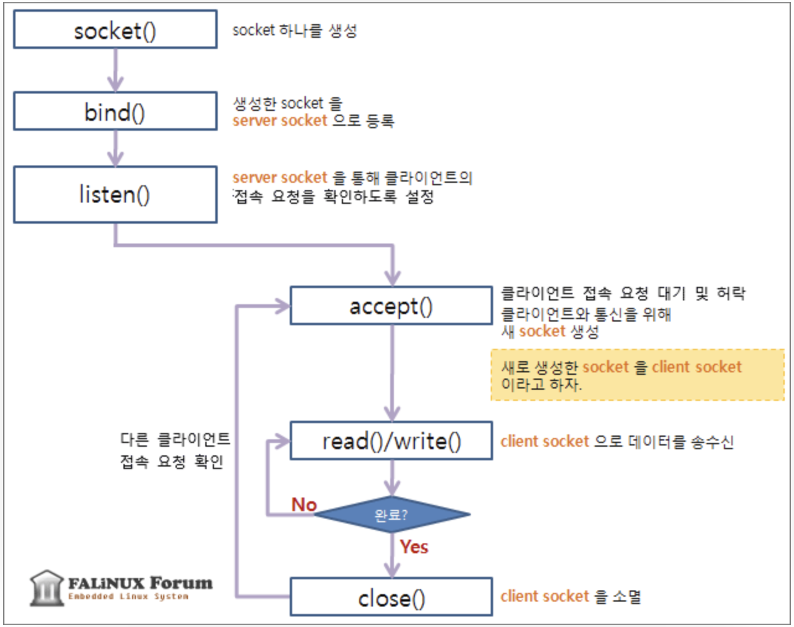
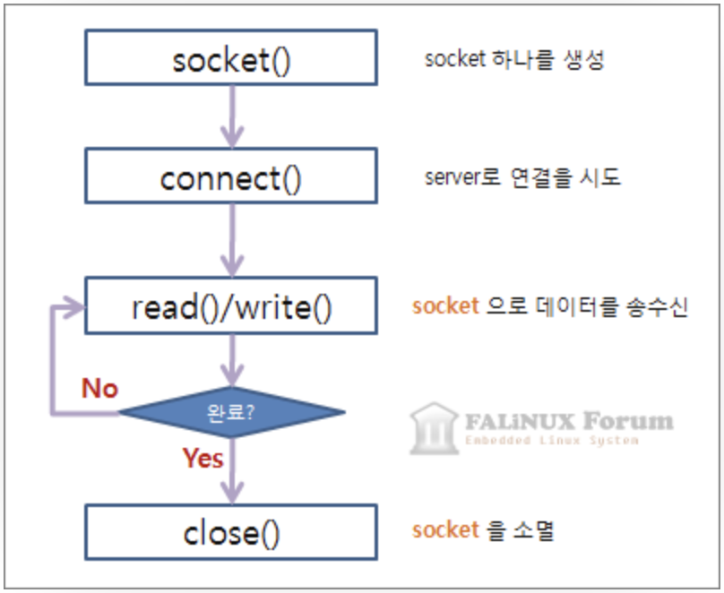
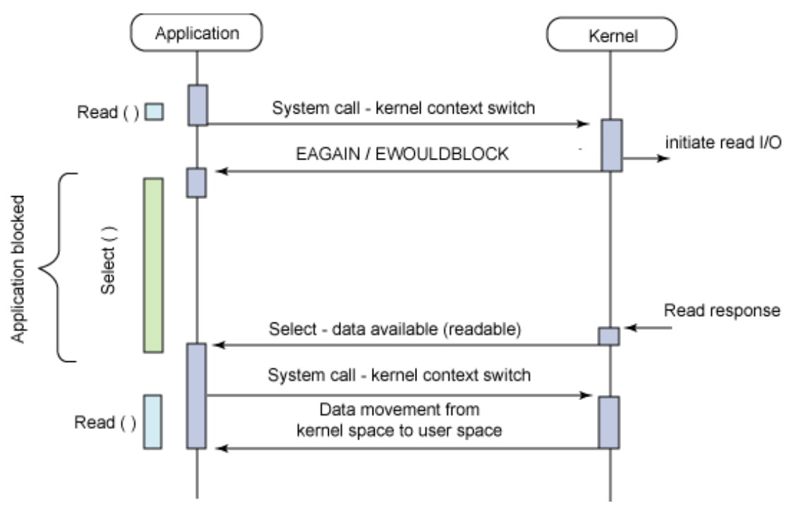

# irc
+ irc 프로토콜을 사용한 채팅 서버를 구현하는 프로젝트

## 소켓 통신
+ TCP/IP 통신 과정
	+ 
	+ server
		+ 
	+ client
		+ 
+ 주요 사용 함수
	1. socket(int domain, int type, int protocol)
		+ 소켓을 만드는데 바로 이 함수를 사용합니다. 소켓 역시 파일로 다루어지기 때문에 반환값은 파일디스크립터입니다. 만약 소켓을 여는데 실패했다면 -1을 리턴합니다.
		+ 인자
			+ int domain : 인터넷을 통해 통신할 지, 같은 시스템 내에서 프로세스 끼리 통신할 지의 여부를 설정합니다.  
				PF_INET, AF_INET :	IPv4 인터넷 프로토콜을 사용합니다.  
				PF_INET6 :	IPv6 인터넷 프로토콜을 사용합니다.  
				PF_LOCAL, AF_UNIX :	같은 시스템 내에서 프로세스 끼리 통신합니다.  
				PF_PACKET :	Low level socket 을 인터페이스를 이용합니다.  
				PF_IPX :	IPX 노벨 프로토콜을 사용합니다.  
			+ int type : 데이터의 전송 형태를 지정하며 아래와 같은 값을 사용할 수 있습니다.  
				SOCK_STREAM :	TCP/IP 프로토콜을 이용합니다.  
				SOCK_DGRAM :	UDP/IP 프로토콜을 이용합니다.  
			+ int protocol : 프로토콜 지정 (0을 입력하면 type에 맞게 자동으로 맞춰짐)  
				IPPROTO_TCP : TCP/IP 프로토콜 이용  
				IPPROTO_DUP : UDP/IP 프로토콜 이용  
	2. connect(int fd, struct sockaddr *remote_host, socklen_t addr_length)
		+ 원격 호스트(원격 컴퓨터)와 연결하는 함수입니다. 연결된 정보는 remote_host에 저장됩니다. 성공시 0, 오류시 -1을 반환합니다.
	3. bind(int fd, struct sockaddr *local_addr, socklen_t addr_length)
		+ 소켓을 바인딩합니다. 이렇게 생각하면 됩니다. 지금 fd로 넘겨지는 소켓과 이 프로세스와 묶는다(bind)라고 생각하시면 됩니다. 그래서 해당 프로세스는 소켓을 통해 다른 컴퓨터로부터 연결을 받아들일 수 있습니다.
	4. listen(int fd, int backlog_queue_size)
		+ 소켓을 통해 들어오는 연결을 듣습니다. backlog_queue_size만큼 연결 요청을 큐에 넣습니다. 성공시 0, 오류시 -1을 반환합니다.
	5. accept(int fd, sockaddr *remote_host, socklen_t *addr_length)
		+ 어떤 컴퓨터에서 이 컴퓨터로 연결할때 연결을 받아들입니다. 함수 이름이 말해주고 있죠. 연결된 원격 컴퓨터의 정보는 remote_host에 저장됩니다. 오류시에 -1을 반환합니다.
	6. send(int fd, void* buffer, size_t n, int flags)
		+ buffer를 소켓 파일 디스크립터인 fd로 전송합니다. 보낸 바이트수를 반환하며 실패시 -1을 반환합니다.
	7. recv(int fd, void* buffer, size_t n, int flags)
		+ send함수와 사용법이 거의 비슷합니다. n바이트를 buffer로 읽습니다. 성공시 받은 바이트수를 반환하며 실패시 -1을 반환합니다.
	8. inet_ntoa(struct in_addr *network_addr) ( ex) inet_ntoa(client_addr.sin_addr) )
		+ 네트워크 주소를 숫자사이의 점을 찍는 IP주소로 network to acsii라는 뜻입니다. ip주소가 담긴 in_addr구조체는 32비트의 네트워크 주소를 갖고 있기 때문에 숫자사이에 점을 찍는 형태로 바꾸려면 이 함수를 사용합니다.
	9. ntohs(Network-to-Host Short) ( ex) ntohs(client_addr.sin_port) )
		+ 이것 역시 네트워크 바이트 순서가 빅 엔디안이고, 호스트의 바이트 순서가 리틀 엔디안일때 변환해야할때 사용합니다. 그 후에는 계속 recv를 통해 클라이언트에서 입력받은 메시지를 서버에서 그대로 출력해줍니다.
	10. setsockopt(int sockfd, int level, int optname, const void *optval, socklen_t optlen)
		+ 파라미터
			+ sockfd
				+ socket(2), accept(2) 등으로 생성된 socket descriptor
			+ level
				+ optname 값이 socket level인지 특정 protocol에 대한 설정인지를 지정하는 값  
				SOL_SOCKET : optname이 socket level에서 설정하는 option명임을 지정함  
				IPPROTO_IP : optname이 IP protocol level에서 설정하는 option명임을 지정함  
				IPPROTO_TCP : optname이 TCP protocol level에서 설정하는 option명임을 지정함  
			+ optname
				+ level의 종류에 따라 다른 설정이름을 갖습니다.  
				SOL_SOCKET level의 상수  
				SO_ACCEPTCONN : accept된 connection 여부 조회(get only) : 1이면 accept(2)된 connection.  
				SO_BROADCAST : datagram socket에 boradcast flag값을 (set/get)  
				SO_DOMAIN : socket에 설정된 domain값 (ex. AF_INET, AF_UNIX 등...)을 얻는다. (get only)  
				SO_ERROR : socket error를 읽고 지움. (get only)  
				SO_DONTROUTE : gateway를 통해서 전송을 금지하고 직접 연결된 host끼리만 전달하게 함. (set/get)  
				SO_KEEPALIVE : cconnection-oriented socket에서 keep alive message를 전송할 수 있도록 함. (set/get)  
				SO_LINGER : linger option 설정 (set/get)  
					```cpp
					struct linger {
						int l_onoff;    /* linger active */
						int l_linger;   /* how many seconds to linger for */
					};
					```
						l_onoff를 1로 설정하면, close(2), shutdown(2) 함수를 실행하면 미전송된 데이터를 정상적으로 전송하거나  
						linger timeout이 도래되면 함수를 return함.  그렇지 않으면 바로 return되고 background로 작업하게 됨.  
					SO_OOBINLINE : out of bound data를 직접 읽을 수 있게 set/get (주로 X.25에서 사용)  
					SO_PROTOCOL : socket에 설정된 protocol을 읽음.  
					SO_RCVBUF : socket에서 읽을 수 있는 최대 buffer의 크기를 set/get함  
					SO_REUSEADDR : bind(2) 시에 local 주소를 재사용할 것인지 여부를 set/get함 (https://m.blog.naver.com/cache798/130080237440)  
					SO_SNDBUF : socket에서 write할 수 있는 최대 buffer의 크기를 set/get함  
					SO_TYPE : 설정된 socket의 type(ex. SOCK_STREAM, SOCK_DGRAM0을 get함  
			+ optval
				+ optname에 따른 설정할 값
			+ optlen
				+ optval의 크기
		+ RETURN
			+ 0 
				+ 정상적으로 option의 값을 설정하였습니다.
			+ -1
				+ 오류가 발생하였으며, 상세한 오류내용은 errno에 설정됩니다.  
				EBADF     : sockfd 유효한 descriptor가 아님.  
				EFAULT    : optval가 이 프로세스의 유효한 메모리 번지가 아님.  
				EINVAL    : optval이나 optlen이 유효하지 않음.  
				ENOPROTOOPT : level이 알려지지 않은 값.  
				ENOTSOCK  : sockfd가 file descriptor이지 socket descriptor가 아님.  

## 다중 입출력(multiplexing I/O)
+ 한 프로세스가 여러 파일을 관리하는 기법
	+ 하나의 서버에서 여러 소켓(IP/Port를 가진 파일)을 관리하여 여러 클라이언트가 접속할 수 있게 하는 기법이다.
	+ 
	+ 여러 소켓의 I/O 처리를 하게되면, 하나의 I/O 요청을 하는 동안 프로그램이 무한정 대기에 빠질 수 있다. select(), poll() 등의 함수를 통해 데이터가 준비 된 경우에만 I/O의 처리를 할 수 있게하여 프로그램이 대기없이 동작하도록 할 수 있다.
	+ 주의할 점
		+ 데이터가 체크섬 실패 등의 이유로 폐기되는 상황일 때, select()나 poll()이 어떤 FD에 데이터가 있으니 읽으라고 알려와서 읽었다가 socket이 block되는 상황이 발생할 수 있다. 이런 상황을 방지하기 위해 socket을 Non-blocking으로 구성하여 EWOULDBLOCK error만 return하고 넘어가게끔 설계하여 안전성을 향상 시킬 수 있다.

+ int poll(struct pollfd *fds, nfds_t nfds, int timeout);
	+ poll(2)함수는 select(2)함수와 비슷한 기능을 하는 함수로 socket / pipe 등에서 동시에 여러개의 I/O를 대기할 경우에 특정한 fd에 blocking되지 않고 I/O를 할 수 있는 상태인 지를 모니터링하여 I/O 가능한 상태의 fd인지를 검사하는 함수입니다.  
	poll(2)함수는 일반파일에서는 사용할 일은 거의 없으며, 주로 socket통신이나 pipe등에서 사용합니다.
	+ 인자
		+ fds
			+ 모니터링할 fd와 event  종류를 설정하고 poll이 반환되었을 때에 그 결과값을 저장하는 구조체
			```cpp
				struct pollfd {
					int   fd;         /* file descriptor */
					short events;     /* requested events */
					short revents;    /* returned events */
				};
			```
			fd : file descriptor  
			events : monitoring할 event 종류로 아래의 상수로 Bit Or 연산으로 여러가지 설정할 수 있습니다.  
			revents : 반환 event로 events에서 설정한 값 중에 일치하는 값과 추가적인 몇가지 event가 설정됩니다.  
			  
			[Event 상수 값]  
			POLLIN : 읽을 데이터가 있습니다.  (events / revents)  
			POLLPRI : 긴급 데이터(Out-of-band Data)를 읽을 것이 있습니다. (events / revents)  
			POLLOUT : 바로 쓸 수 있는 상태입니다. (events / revents)  
			POLLWRBAND : 긴급 데이터(Out-of-band data)를 쓸 수 있습니다. (events / revents);  
			POLLERR : 주어진 file descriptor에 오류가 있습니다. (revents only)  
			POLLHUP : 주어진 file descriptor에서 event가 지체되고 있습니다. (revents only)  
			POLLNVAL : 주어진 file descriptor가 유효하지 않습니다. (revents only)  
		+ nfds
			+ 설정된 fd의 개수
		+ timeout
			+ milliseconds(1/1000초) 단위의 timeout을 설정
			+ 0을 설정하면 poll(2)함수는 바로 return 됩니다.
			+ -값이면 타임아웃이 무한대로 설정됩니다. 즉, event가 발생할 때까지 무한 대기합니다.
	+ Return
		+ 1 이상
			+  Event가 발생한 fd의 갯수
		+ 0
			+ timeout이 발생하였습니다.
		+ -1
			+ 오류가 발생하였으며, 상세한 오류내용은 errno에 설정됩니다.  
			EFAULT : fds 변수가 프로그램의 주소  공간에 있지 않습니다.  
			EINTR : signal이 발생하였습니다.  
			EINVAL : nfds 값이 RLIMIT_NOFILE를 초과하였습니다.  
			ENOMEM : file descriptor table 메모리 할당을 위한 공간이 없습니다.  

## Reference
+ RFC1459
	+ https://datatracker.ietf.org/doc/html/rfc1459
+ ERROR CODE
	+ https://www.alien.net.au/irc/irc2numerics.html
+ 소켓 연결 예제
	+ https://blog.naver.com/PostView.naver?blogId=handong217&logNo=222137292740&parentCategoryNo=&categoryNo=1&viewDate=&isShowPopularPosts=false&from=postView